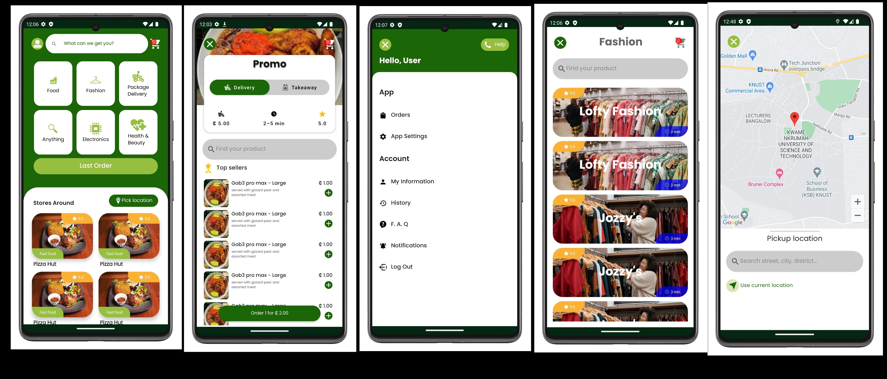

# Oga Send Me Delivery App


## Overview

Oga Send Me is a delivery app developed using the latest Android technologies and architectural patterns. This project aims to provide a reliable and user-friendly solution for delivery services, utilizing Jetpack Compose, Room Database, MVVM, Kotlin Coroutines, Clean Architecture, Firebase, and Dependency Injection (Hilt/Dagger).

**app screen shots**



## Features

- **User Authentication:** Secure user registration and login using Firebase Authentication.

- **Order Management:** Users can create, edit, and track their orders in real-time.

- **Location Services:** Utilizes device location services to provide accurate tracking and delivery information.

- **Payment Integration:** Seamless integration with payment gateways for easy and secure transactions.

- **Clean Architecture:** The app is built using a modular, clean architecture to ensure code maintainability and scalability.

- **Offline Support:** Utilizes Room Database to provide offline functionality for order management.

## Technology Stack

- **Jetpack Compose:** The modern Android UI toolkit for creating a native user interface.

- **Room Database:** A SQLite object mapping library that provides local data persistence.

- **MVVM (Model-View-ViewModel):** An architectural pattern that separates the application into three interconnected components.

- **Kotlin Coroutines:** Simplifies asynchronous programming in Kotlin.

- **Clean Architecture:** An architectural pattern that enforces a clear separation of concerns in your codebase.

- **Firebase:** Utilized for user authentication, real-time database, and cloud functions.

- **Dependency Injection:** Hilt/Dagger for managing dependencies and promoting testability.

- **Retrofit:** A type-safe HTTP client for making network requests.

## Getting Started

To run the Oga Send Me app on your local machine, follow these steps:

1. Clone this repository:

   ```bash
   git clone https://github.com/yourusername/oga-send-me.git

1. Open the project in Android Studio.

1. Set up Firebase: Create a Firebase project and configure your app. Update the `google-services.json` file with your Firebase configuration.

1. Build and run the app on an Android emulator or physical device.

1. Enjoy using Oga Send Me!


